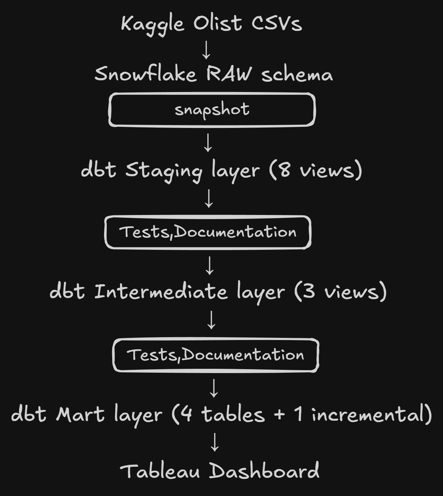
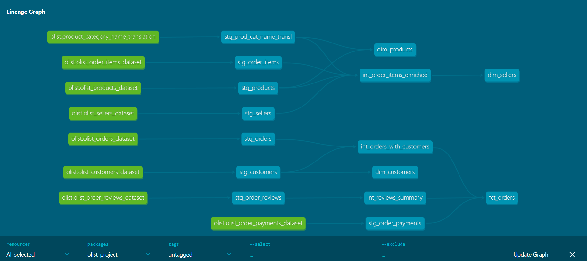
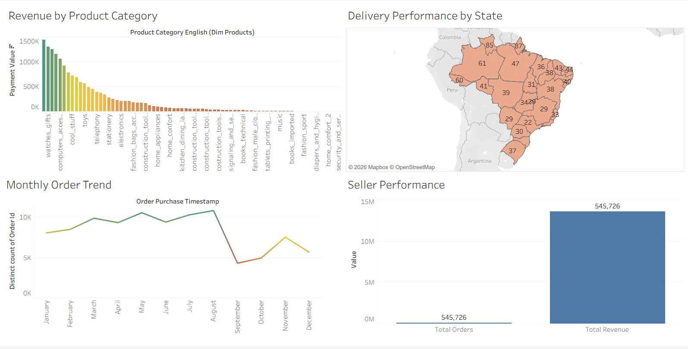

# Olist E-Commerce Analytics Pipeline

End-to-end dbt data pipeline on the Brazilian E-Commerce 
Olist dataset, built on Snowflake with Tableau dashboards.

## Architecture

## Tech Stack
- dbt Core 1.11
- Snowflake (SnowPro Core Certified)
- Tableau Desktop
- Python

## Project Structure
\`\`\`
models/
    staging/     8 views — clean and rename raw tables
    intermediate/ 3 views — join and enrich staging data
    marts/       4 tables — business-ready analytics layer
snapshots/       SCD Type 2 on customers table
seeds/           Reference data — payment types, order status
macros/          Reusable SQL functions
tests/           45 data quality tests across all layers
\`\`\`

## Data Lineage DAG

## Dashboard

## Business Questions Answered
1. What is total revenue by product category?
2. What is the monthly order volume trend?
3. Which states have the longest delivery times?
4. Which sellers generate the most revenue?
5. What percentage of orders are delivered on time?

## How to Run
\`\`\`bash
# Install dependencies
pip install dbt-snowflake

# Set up profiles.yml with your Snowflake credentials

# Run full pipeline
dbt build

# Generate documentation
dbt docs generate
dbt docs serve
\`\`\`

## Tests
45 data tests across all model layers including:
- not_null and unique on all primary keys
- accepted_values on order_status and payment_type
- relationships between staging models
- singular test for positive payment values